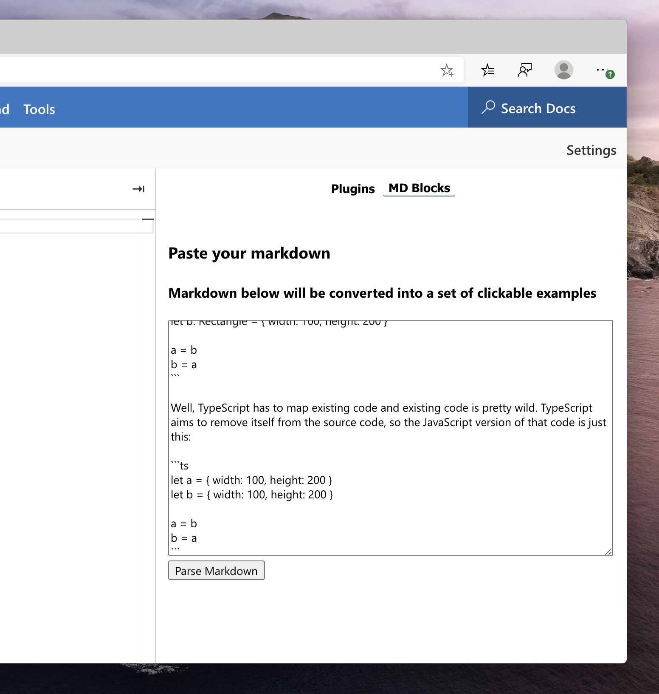
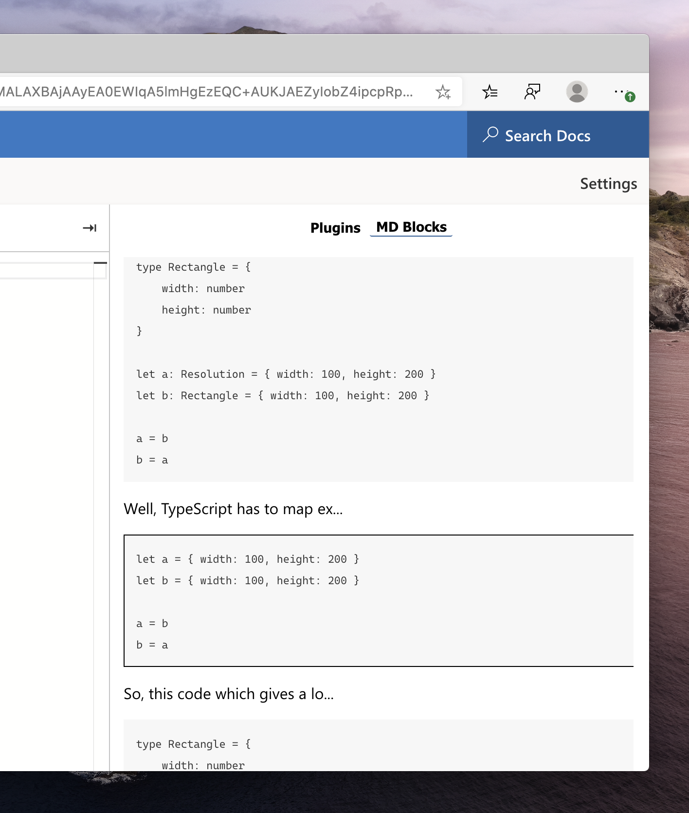

## Markdown Codeblock Examples

Takes a markdown document and lets you click through all of the TypeScript samples as a sidebar. Perfect for talks where you have all the code ahead of time and want to talk through each bit one by one.

So, first you put in your markdown.



Then you click through the code samples from each codeblock 



#### How it works

The parser will pick up any codeblock like this:

````
Some preamble:

```ts
type MyThing = {

}
```
````

- **Language** - is important, any language other than `ts` or `tsx` will show when selected, but with TypeScript's error handling disabled
- **Whitespace** - is unimportant in detection, so fenced codeblocks will turn up too
- **Keyboard-only** - once you have selected a codeblock, **when in the editor** you can press `cmd/ctrl + g` to move to the next codeblock

## Running this plugin

- [Click this link](https://www.staging-typescript.org/play?install-plugin=playground-plugin-codeblocks-examples) to install

or

- Open up the TypeScript Playground
- Go the "Plugins" in the sidebar
- Look for "Plugins from npm"
- Add "playground-plugin-codeblocks-examples"
- Reload the browser

Then it will show up as a tab in the sidebar.

## Contributing

See [CONTRIBUTING.md](./CONTRIBUTING.md) for the full details, however, TLDR:

```sh
git clone ...
yarn install
yarn start
```

Then tick the box for starting plugin development inside the TypeScript Playground.
